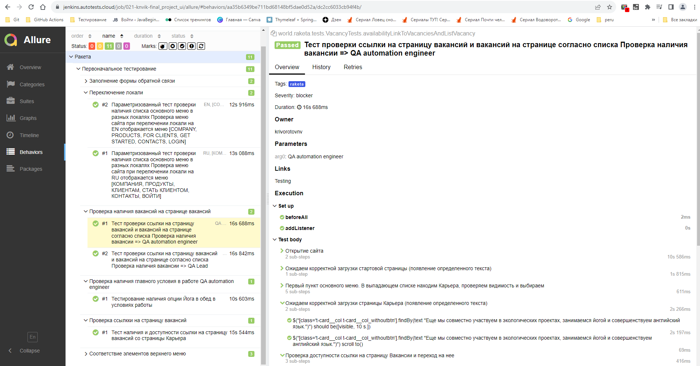
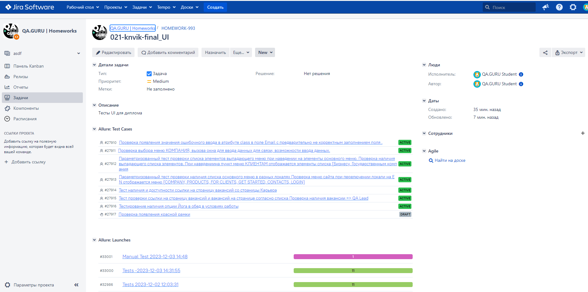

<h1> Проект по автоматизации тестовых сценариев для сайта цифровой платформы для организации командировок и управления расходами  </h1>

## :pushpin: Содержание:

- [Использованный стек технологий](#computer-использованный-стек-технологий)
- [Запуск тестов из терминала](#arrow_forward-запуск-автотестов)
- [Сборка в Jenkins](#-сборка-в-jenkins)
- [Пример Allure-отчета](#-пример-allure-отчета)
- [Интеграция с Allure TestOps](#-интеграция-с-allure-testOps)
- [Интеграция с Jira](#-интеграция-с-jira)
- [Уведомления в Telegram с использованием бота](#-уведомления-в-telegram-с-использованием-бота)
- [Видео примера запуска тестов в Selenoid](#-видео-примера-запуска-тестов-в-selenoid)
  
## :computer: Использованный стек технологий


<p align="center">


</p>

- В данном проекте автотесты написаны на языке `Java` с использованием фреймворка для тестирования `Selenide`.
- В качестве сборщика был использован - `Gradle`.
- Использованы фреймворки `JUnit 5` и [Selenide](https://selenide.org/).
- При прогоне тестов браузер запускается в [Selenoid](https://aerokube.com/selenoid/).
- Для удаленного запуска реализована джоба в `Jenkins` с формированием Allure-отчета и отправкой результатов в `Telegram` при помощи бота.


Содержание Allure-отчета:
* Шаги теста;
* Скриншот страницы на последнем шаге;
* Page Source;
* Логи браузерной консоли;
* Видео выполнения автотеста.

## :arrow_forward: Запуск автотестов

### Запуск тестов из терминала
```
gradle clean run_raketa  -Denv=remote

```
При выполнении команды, данные тесты запустятся удаленно в <code>Selenoid</code>.


При необходимости также можно переопределить параметры запуска

```
clean
${TASK} -DremoteUrl=${SELENOID_URL}

```

### Параметры сборки

* <code>REMOTE_BROWSER_URL</code> – адрес удаленного сервера, на котором будут запускаться тесты.

##  Сборка в Jenkins

Для запуска сборки необходимо перейти в раздел Собрать с параметрами и нажать кнопку Собрать.

<p align="center">

</p>

<kbd>[](https://jenkins.autotests.cloud/job/021-knvik-jenkins_raketa_all_alltops_jira_tg_config/)</kbd>

##  Пример Allure-отчета
### Overview

<p align="center">

</p>

### Результат выполнения теста

<p align="center">

</p>

<p align="center">

</p>


##  Интеграция с Allure TestOps

Выполнена интеграция сборки <code>Jenkins</code> с <code>Allure TestOps</code>.
Результат выполнения автотестов отображается в <code>Allure TestOps</code>
На Dashboard в <code>Allure TestOps</code> отображена статистика пройденных тестов.


<p align="center">

</p>

<p align="center">

</p>

##  Интеграция с Jira

Реализована интеграция <code>Allure TestOps</code> с <code>Jira</code>, в тикете отображается информация, какие тест-кейсы были написаны в рамках задачи и результат их прогона.

<p align="center">

</p>


##  Уведомления в Telegram с использованием бота

После завершения сборки, бот созданный в <code>Telegram</code>, автоматически обрабатывает и отправляет сообщение с результатом.

<p align="center">

</p>

## Видео примера запуска тестов в Selenoid

К каждому тесту в отчете прилагается видео прогона.
<p align="center">
  
</p>