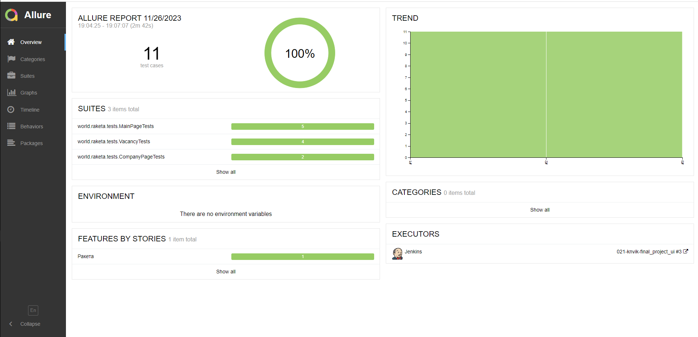
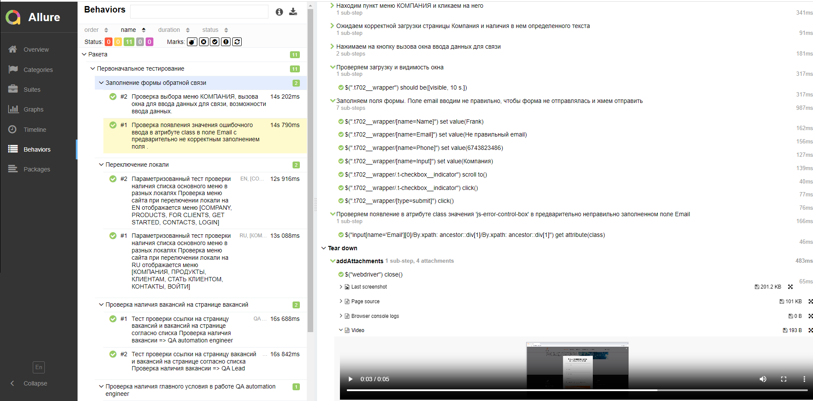
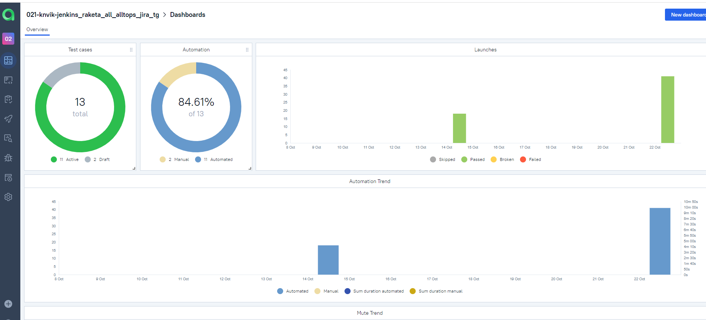
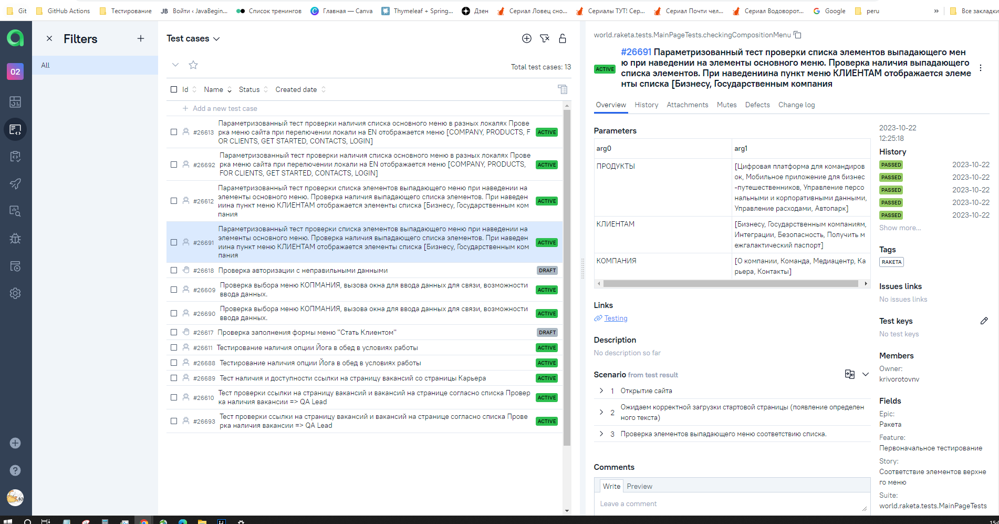

<h1> Проект по автоматизации тестовых сценариев для сайта цифровой платформы для организации командировок и управления расходами  </h1>
<p align="center">

</p> 

* ### https://raketa.world/ – тестируемый ресурс.


## :pushpin: Содержание:

- [Использованный стек технологий](#computer-использованный-стек-технологий)
- [Запуск тестов из терминала](#arrow_forward-запуск-автотестов)
- [Сборка в Jenkins](#-сборка-в-jenkins)
- [Пример Allure-отчета](#-пример-allure-отчета)
- [Интеграция с Allure TestOps](#-интеграция-с-allure-testOps)
- [Интеграция с Jira](#-интеграция-с-jira)
- [Уведомления в Telegram с использованием бота](#-уведомления-в-telegram-с-использованием-бота)
- [Видео примера запуска тестов в Selenoid](#-видео-примера-запуска-тестов-в-selenoid)
  
## :computer: Использованный стек технологий


<p align="center">


</p>

- В данном проекте автотесты написаны на языке `Java` с использованием фреймворка для тестирования `Selenide`.
- В качестве сборщика был использован - `Gradle`.
- Использованы фреймворки `JUnit 5` и [Selenide](https://selenide.org/).
- При прогоне тестов браузер запускается в [Selenoid](https://aerokube.com/selenoid/).
- Для удаленного запуска реализована джоба в `Jenkins` с формированием Allure-отчета и отправкой результатов в `Telegram` при помощи бота.


Содержание Allure-отчета:
* Шаги теста;
* Скриншот страницы на последнем шаге;
* Page Source;
* Логи браузерной консоли;
* Видео выполнения автотеста.

## :arrow_forward: Запуск автотестов

### Запуск тестов из терминала
```
gradle clean run_raketa 
```
При выполнении команды, данные тесты запустятся на локальной машине.

```
gradle clean run_raketa -DisRemote=true
```
При выполнении команды, данные тесты запустятся удаленно в <code>Selenoid</code>.


При необходимости также можно переопределить параметры запуска


### Параметры сборки

* <code>isRemote</code> – локальная машина либо удаленный Selenoid.
* <code>selenoidUI</code> – базовый адрес удаленного сервера Selenoid .
* <code>browser </code> –  браузер для запуска тестов.
* <code>browserVersion</code> – версия браузера.
* <code>browserSize</code> – разрешение браузера.


##  <a href="https://jenkins.autotests.cloud/job/021-knvik-jenkins_raketa_all_alltops_jira_tg/" target="_blank" rel="noopener"><span>Сборка в Jenkins</span> </a>

Для запуска сборки необходимо перейти в раздел Собрать с параметрами и нажать кнопку Собрать. 

####   Доступные для изменения параметры :
* <code>TASK</code> – выбор задачи.
* <code>BROWSER</code> –  браузер для запуска тестов.
* <code>BROWSER_VERSION</code> – версия браузера.
* <code>BROWSER_SIZE</code> – разрешение браузера.


<kbd>[](https://jenkins.autotests.cloud/job/021-knvik-final_project_ui/)</kbd>

##  Пример Allure-отчета
##### <a href="https://jenkins.autotests.cloud/job/021-knvik-jenkins_raketa_all_alltops_jira_tg/16/allure/#" target="_blank" rel="noopener"><span>Overview</span> </a>


<kbd>[](https://jenkins.autotests.cloud/job/021-knvik-final_project_ui/allure/)</kbd>

#####  <a href="https://jenkins.autotests.cloud/job/021-knvik-jenkins_raketa_all_alltops_jira_tg/16/allure/#suites/129ac936ae3c796ae95cabb5edc1b869/16a8391194530603/" target="_blank" rel="noopener"><span>Результат выполнения теста</span> </a>

<kbd>[](https://jenkins.autotests.cloud/job/021-knvik-final_project_ui/allure/#behaviors/aa35b6349be711bd68148bf5dae0d52a/dc2cc6033cb94f4b/
)</kbd>

#### <a href="https://jenkins.autotests.cloud/job/021-knvik-jenkins_raketa_all_alltops_jira_tg/16/allure/#behaviors/ad278f761a7c8b2f9f37925e0bd8ca8e/db272aebe61ef5c/" target="_blank" rel="noopener"><span>Behaviors</span> </a>

<kbd>[](https://jenkins.autotests.cloud/job/021-knvik-final_project_ui/allure/#behaviors/6c3d8c6182db1f06d81dd501ad395535/1ae3098a66ec0716/
)</kbd>

##  Интеграция с Allure TestOps

Выполнена интеграция сборки <code>Jenkins</code> с <code>Allure TestOps</code>.
Результат выполнения автотестов отображается в <code>Allure TestOps</code>
На Dashboard в <code>Allure TestOps</code> отображена статистика пройденных тестов.


##### <a href="https://allure.autotests.cloud/project/3718/dashboards" target="_blank" rel="noopener"><span>Dashboards</span> </a>

<kbd>[](https://allure.autotests.cloud/project/3718/dashboards)</kbd>

##### <a href="https://allure.autotests.cloud/project/3718/test-cases/26691?treeId=0" target="_blank" rel="noopener"><span>Test cases</span> </a>

<kbd>[](https://allure.autotests.cloud/project/3718/test-cases/26691?treeId=0)</kbd>

##  Интеграция с Jira

Реализована интеграция <code>Allure TestOps</code> с <code>Jira</code>, в тикете отображается информация, какие тест-кейсы были написаны в рамках задачи и результат их прогона.

##### <a href="https://jira.autotests.cloud/browse/HOMEWORK-914" target="_blank" rel="noopener"><span>Jira</span> </a>

<kbd>[](https://jira.autotests.cloud/browse/HOMEWORK-993)</kbd>


##  Уведомления в Telegram с использованием бота

После завершения сборки, бот созданный в <code>Telegram</code>, автоматически обрабатывает и отправляет сообщение с результатом.

<p align="center">

</p>

## Видео примера запуска тестов в Selenoid

К каждому тесту в отчете прилагается видео прогона.
<p align="center">
  
</p>